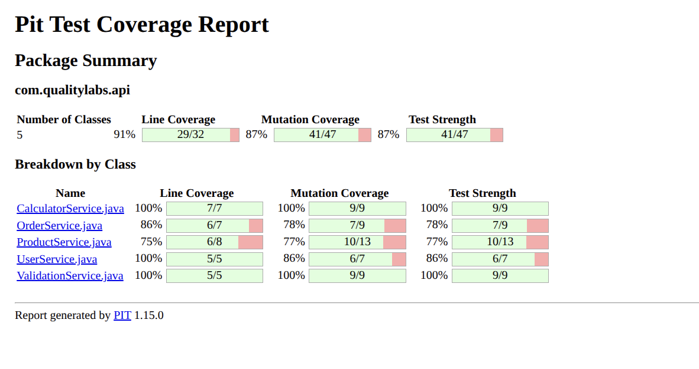

# 🧪 Mutation Testing with Pitest in Spring Boot


## 🚀 What is Mutation Testing?

Mutation testing is a technique to evaluate the quality of your unit tests, not the quality of your code. Its goal is not to find bugs in production code, but to discover weaknesses in the tests you already have.

It's like a "stress test" for your tests. Imagine your tests are a security system. Mutation testing introduces small failures to see if your security system detects them.

### 🔍 How Does Mutation Testing Work?

The process can be summarized in three steps:

1. **Introduce Mutants**: The mutator is a tool that automatically introduces small and subtle changes to your code, called mutants. A mutant can be a change like:
   - Change `>` to `>=`
   - Change `&&` to `||`
   - Remove a line of code

2. **Run the Tests**: All your unit tests are executed against each mutated version of your code.

3. **Analyze the Results**: The results are classified as follows:
   - **Killed Mutant**: One of your tests failed when executed against the mutated code. This is good, as it means your tests are robust enough to detect the failure.
   - **Survived Mutant**: All your tests passed even with the mutant present. This is bad, as it means your tests are ineffective and fail to detect a failure.

The ultimate goal is to have a high rate of "killed" mutants. If a mutant survives, you have a gap in your tests that you need to cover.

### 🛠️ What is Pitest Used For?

Pitest is the most popular tool for doing mutation testing in Java projects. It simplifies and automates the entire process I just described.

Instead of you having to manually introduce failures and run tests, Pitest does all the work for you. It integrates with Maven or Gradle and does the following:
- Creates mutants.
- Runs tests against each mutant in an optimized way.
- Generates a detailed HTML report that shows the percentage of killed mutants (the Mutation Score), as well as the exact location of survived mutants, so you know where you need to improve your tests.

### Visualizing the Report

You can see an example of the generated mutation report:



In summary, mutation testing is the concept and technique, while Pitest is the tool that allows you to apply that technique in a practical and professional way in your projects. It's one of the best ways to ensure that your tests not only meet code coverage, but are truly effective.


## 📂 Project Structure

```
mutation-testing-pitest/
├── .github/
│   └── workflows/
│       └── mutation-test.yml     # GitHub Actions configuration for Pitest
├── src/
│   ├── main/
│   │   └── java/com/qualitylabs/api/
│   │       ├── OrderService.java      # Order management service
│   │       ├── ProductService.java    # Product service
│   │       ├── UserService.java       # User service
│   │       └── ValidationService.java # Validation service
│   └── test/
│       └── java/com/qualitylabs/api/
│           ├── OrderServiceTest.java
│           ├── ProductServiceTest.java
│           ├── UserServiceTest.java
│           └── ValidationServiceTest.java
├── .gitignore
├── pom.xml                         # Maven configuration and dependencies
└── README.md                       # This file
```
## 🚦 How to Run Mutation Tests

### Local Execution

To run mutation tests on your local machine, use the following Maven command:

```
mvn test org.pitest:pitest-maven:mutationCoverage
```

This command will do the following:
1. Run your unit tests (to ensure they pass).
2. Launch Pitest's mutation analysis, which will create "mutants" and verify if your tests are robust enough to detect them.

### Viewing Results

When it finishes, you'll find the complete Pitest report at:
```
target/site/pitest/index.html
```

Open this file in your browser to see:
- Overall mutation score
- Killed vs. survived mutants
- Details by class and method
- Suggestions to improve your tests

## 🔄 Integration with GitHub Actions

The project includes a GitHub Actions workflow that automatically runs mutation tests on every push to the `main` or `develop` branches.

To see the results on GitHub:
1. Go to the "Actions" tab in your repository
2. Select the most recent run of the "Mutation Testing" workflow
3. Download the report from the artifacts or check the summary in the summary section

## 🔄 Integration with GitLab CI/CD

To integrate mutation tests into your GitLab CI/CD pipeline, create a `.gitlab-ci.yml` file with the following configuration:

```yaml
stages:
  - test
  - mutation-test

variables:
  MAVEN_OPTS: "-Dmaven.repo.local=./.m2/repository"
  MAVEN_CLI_OPTS: "--batch-mode --errors --fail-at-end --show-version -DinstallAtEnd=true -Dmaven.test.failure.ignore=true"

cache:
  key: ${CI_COMMIT_REF_SLUG}
  paths:
    - .m2/repository/
    - target/

# Run unit tests first
unit-test:
  stage: test
  image: maven:3.8.6-openjdk-11
  script:
    - mvn $MAVEN_CLI_OPTS clean test
  artifacts:
    paths:
      - target/surefire-reports/
    when: always
    expire_in: 1 week

# Run mutation tests
pitest_mutation:
  stage: mutation-test
  image: maven:3.8.6-openjdk-11
  script:
    - mvn $MAVEN_CLI_OPTS org.pitest:pitest-maven:mutationCoverage
  artifacts:
    paths:
      - target/pit-reports/
      - target/site/pitest/
    when: always
    expire_in: 1 month
  rules:
    - if: $CI_PIPELINE_SOURCE == "merge_request_event"  # Run on MRs
    - if: $CI_COMMIT_BRANCH == $CI_DEFAULT_BRANCH      # Run on main branch
    - if: $CI_COMMIT_BRANCH == "develop"               # Run on develop
```

### Mutation Threshold Behavior

The parameter `<mutationThreshold>75</mutationThreshold>` in the `pom.xml` controls the pipeline behavior:

- **If mutation is ≥ 75%**:
  - The command `mvn org.pitest:pitest-maven:mutationCoverage` finishes successfully (code 0)
  - The `pitest_mutation` job in GitLab CI passes
  - The pipeline continues with the following stages

- **If mutation is < 75%**:
  - The command fails with a non-zero exit code
  - The `pitest_mutation` job in GitLab CI fails
  - The complete pipeline fails
  - If you have branch protection rules in GitLab, this will prevent code merging until resolved

### Recommended Configuration for Protected Branches

To ensure code quality, configure the following rules in your GitLab repository's protected branches configuration:

1. Go to **Settings > Repository > Protected Branches**
2. Select your main branches (main, develop)
3. Enable "Allows merge only when pipeline succeeds"
4. Enable "Allows pushes from members who can merge to the branch"
5. Optional: Enable "Require approval from code owners"

This will ensure that no code with insufficient mutation coverage can be merged into your main branches.

## 📊 Example Services and Tests

The project includes several example services with their respective tests to demonstrate different aspects of mutation testing:

- **ProductService**: Demonstrates arithmetic and condition mutations
- **UserService**: Shows age validations and welcome messages
- **OrderService**: Exemplifies mutations in logical conditions
- **ValidationService**: Includes email and password validations

Each service has unit tests that cover different scenarios, some intentionally weak to demonstrate how Pitest can help you identify gaps in test coverage.

## 📚 Additional Resources

- [Official Pitest Documentation](https://pitest.org/)
- [Pitest Guide with Maven](https://maven.apache.org/plugins/maven-surefire-plugin/examples/junit-platform.html)
- [Examples of Common Mutations](https://pitest.org/quickstart/mutators/)
